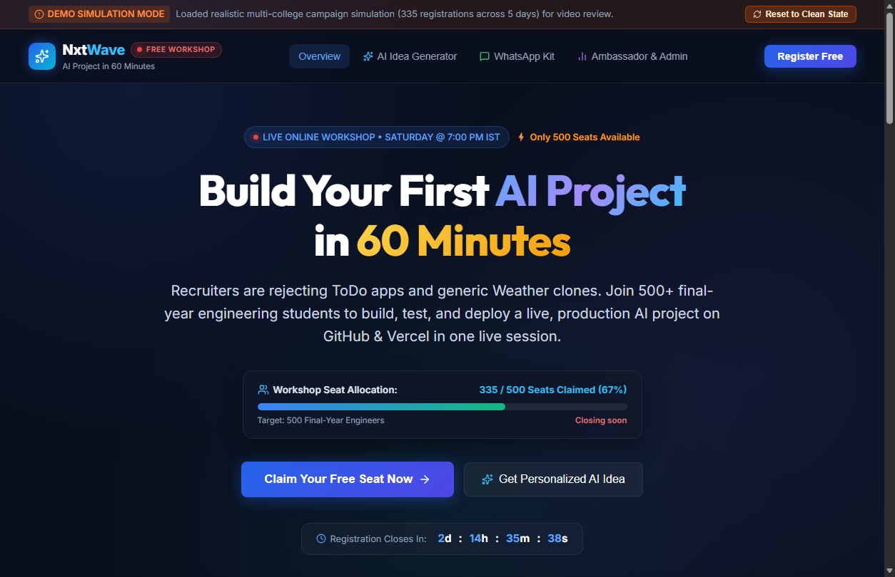
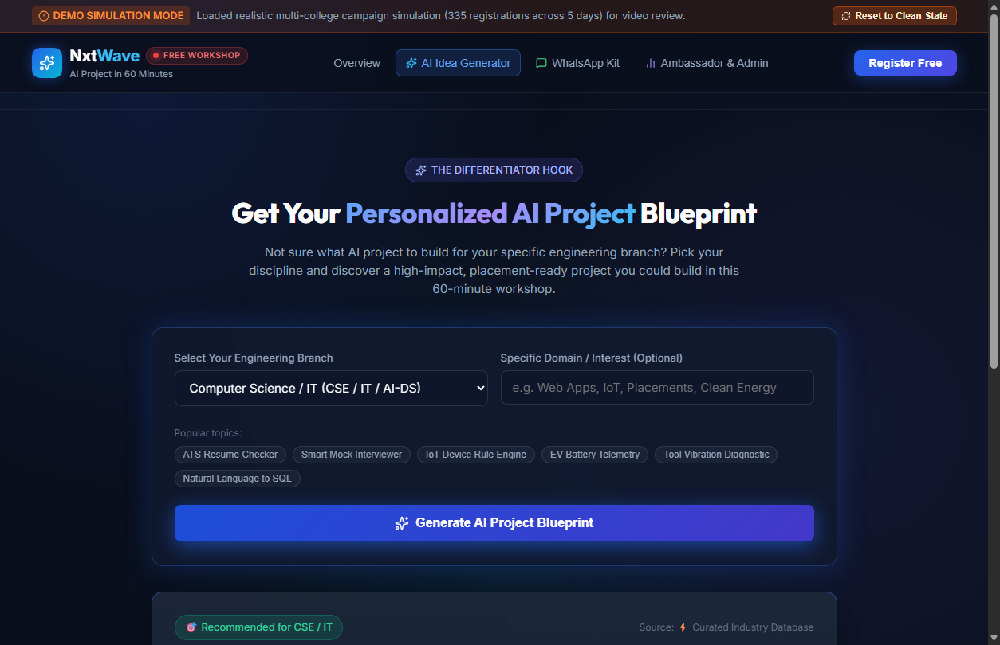
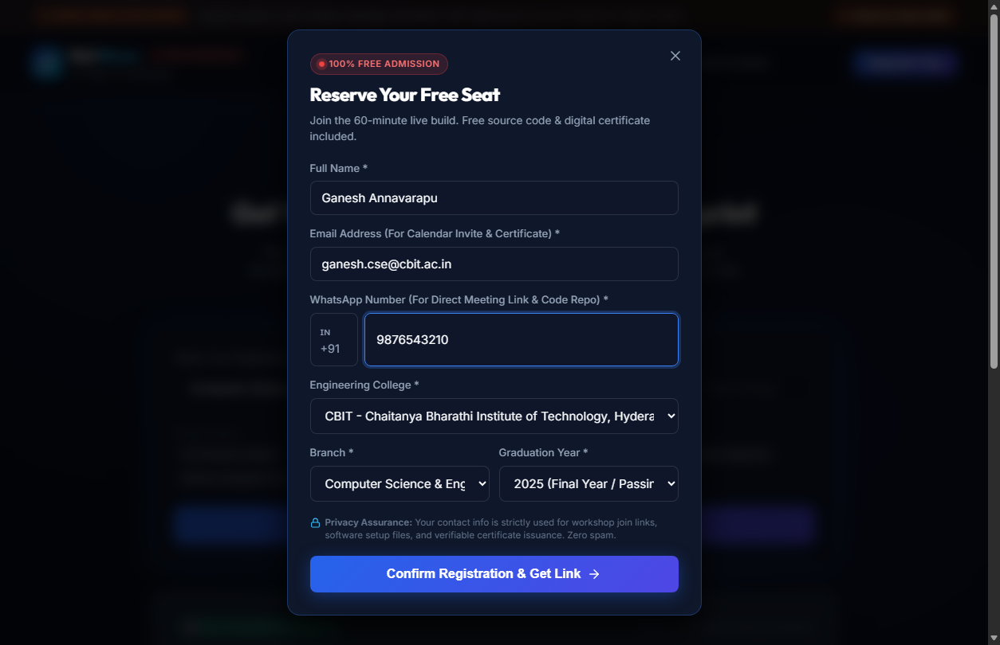
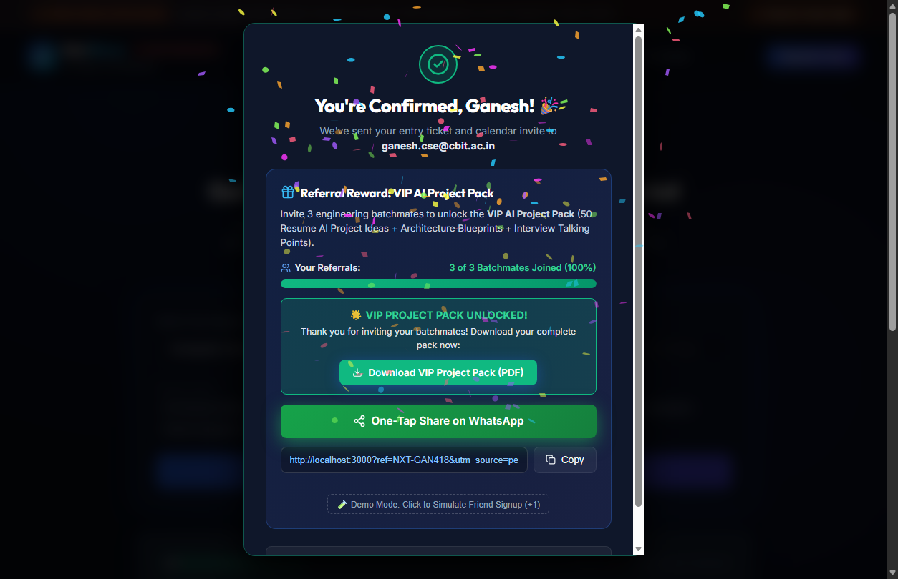
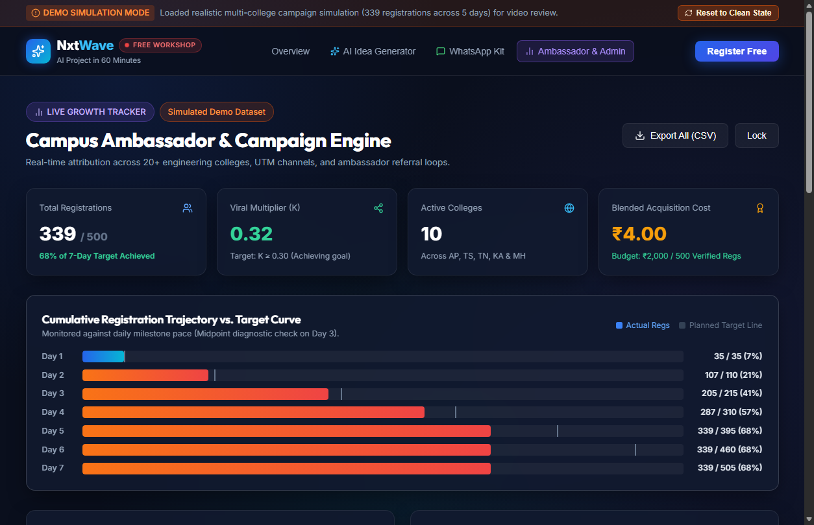
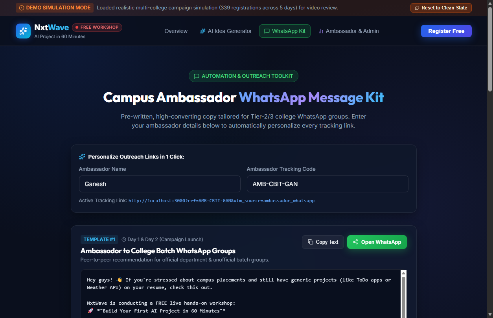

# 🚀 Referral-Powered Registration Engine
### NxtWave Growth Intern Challenge — Round 1 Submission

> **Goal:** Get **500 final-year engineering students** to register for the free workshop **"Build Your First AI Project in 60 Minutes"** in **7 days** with a **₹2,000** budget.
>
> **My answer:** Not just a landing page, but a registration *system* with a built-in referral loop, an AI hook that gives students a reason to care, and a dashboard to run the campaign.

**Candidate:** Annavarapu Ganesh · B.Tech CSE (2027) · Applying for: Growth Intern, NxtWave

---

## 🔗 Quick Links

| Resource | Link |
|---|---|
| 🌐 Live demo | [NxtWave Growth Challenge](https://nxt-wave-growth-challenge-one.vercel.app/) |
| 🎥 3-minute video | [Google Drive Video](https://drive.google.com/file/d/1JnGN36-DE74cWfe3srx2bh-WvGUNyhqb/view?usp=sharing) |
| 📊 5-slide growth plan | [NxtWave Growth Plan PPT](https://docs.google.com/presentation/d/1O4k-gFvEhzPLe_LwtuL0EnIDpP61EYl5/edit?usp=sharing) |
| 📄 2-page summary | [`NxtWave_Growth_Plan_Summary.pdf`](nxtwave-challenge/growth-plan/NxtWave_Growth_Plan_Summary.pdf) |
| 🧠 AI + learning notes | [`ai-notes.md`](nxtwave-challenge/learning-notes/ai-notes.md) |
| 🔍 Reflection | [`reflection.md`](nxtwave-challenge/reflection.md) |
| 💼 LinkedIn | [Annavarapu Ganesh](https://www.linkedin.com/in/annavarapu-ganesh-4159732a5/) |

---

## 1. Understanding the Student

**Who:** Final-year engineering students (CSE, IT, ECE, EEE and allied branches) in Tier-2/3 colleges, preparing for software roles and campus placements.

**What they worry about:** Their resumes carry the same tutorial projects as everyone else (to-do apps, weather apps, clones), and many believe AI is "too advanced" for them.

**What makes them register:**

| Trigger | How the campaign delivers it |
|---|---|
| A real project, not another tutorial | "Walk away with a deployed AI project in 60 minutes" |
| Low risk | Free, beginner-friendly, no prerequisites |
| Proof for recruiters | Certificate and a project they can show |
| Peer pressure (the good kind) | Registration comes via classmates and WhatsApp groups they already trust |

---

## 2. The Campaign Plan (4 channels, prioritized)

| # | Channel | What I'd do | Target regs | Share |
|---|---|---|---|---|
| 1 | **Campus ambassadors + WhatsApp** | Student ambassadors seed batch groups using a ready-made message kit and tracked links | 220 | 44% |
| 2 | **Post-signup referral loop** | After signup, students unlock a VIP AI Project Pack by inviting 3 batchmates (1-tap WhatsApp share) | 160 | 32% |
| 3 | **College clubs & placement circulars** | Club leads and placement coordinators circulate a skills notice | 80 | 16% |
| 4 | **Short-form social + micro-boost** | Reels/carousels plus a small geo-targeted boost routed into the WhatsApp flow | 40 | 8% |
| | **Total** | | **500** | **100%** |

**Why this works:** Students trust peers far more than ads. Channels 1 and 3 get the first wave in, channel 2 compounds it for free, and channel 4 fills gaps.

> The conversion rates behind these targets are **planning assumptions**, not measured results (see [Limitations](#-limitations--honest-notes)).

### 7-Day Rhythm
- **Days 1–2:** Onboard ambassadors, send the message kit, circulate club and placement notices
- **Days 3–5:** Referral loop peaks, social boost runs, daily check against the pace line
- **Days 6–7:** Reminder messages, "last seats" push, final ambassador sprint

### Contingency (if behind pace on Day 3)
1. Run a 24-hour ambassador flash contest (budget shifted from the ad line)
2. Ambassadors drop short voice notes in batch groups
3. Concentrate remaining ad spend on the top-converting colleges

---

## 💰 Budget: ₹2,000

| Activity | Budget |
|---|---|
| Campus ambassador incentives (top performers) | ₹1,000 |
| Instagram/Meta micro-boost | ₹600 |
| Live workshop hackathon prize (drives live attendance) | ₹400 |
| Tools & infrastructure (free tiers) | ₹0 |
| **Total** | **₹2,000** |

---

## 3. The Working Asset

A mobile-first web app (**Vite + React**) that runs the whole funnel, from first click to referral tracking.

### What it does

| Feature | Why it exists |
|---|---|
| 🤖 **AI Project Idea Generator** | A student picks branch + interest and gets a tailored beginner AI project idea. This is the hook that makes people *want* the workshop. Uses Gemini if an API key is set, otherwise a curated library of branch-specific ideas |
| 📝 **Registration flow + duplicate protection** | Validates name, email, 10-digit WhatsApp number, college, branch, graduation year. Blocks duplicates by email/phone and sends returning students to their referral page |
| 🔗 **Personalized referral links** | Every registrant instantly gets their own link (`?ref=...`) |
| 💬 **1-tap WhatsApp sharing** | Prefilled message with the student's link, built for how students actually share |
| 📈 **Referral progress + VIP pack unlock** | "X of 3 batchmates joined" progress bar tied to a reward |
| 🎓 **Ambassador & admin dashboard** | Registrations by college and channel, daily trend vs. the 500 target, ambassador leaderboard, searchable registrations, CSV export |
| 📲 **WhatsApp message kit** | 5 copy-ready, auto-personalized templates: ambassador outreach, formal circular, T-24h reminder, T-1h reminder, post-workshop follow-up |
| 🎬 **Demo simulation mode** | Toggle between a clean database and a simulated multi-college dataset so the dashboard can be demoed |
| ⚙️ **Automation workflows** | n8n workflow and Google Apps Script endpoint in `asset/workflows/` |
| ✅ **Unit tests** | Cover validation, referral codes and duplicate protection |

### Screenshots

| Landing | AI Idea Generator | Registration |
|---|---|---|
|  |  |  |

| Referral Loop | Admin Dashboard | WhatsApp Kit |
|---|---|---|
|  |  |  |

---

## 💻 Run It Locally

```bash
cd nxtwave-challenge/asset
npm install
npm run dev        # open the URL shown in the terminal
```

**Optional:** copy `.env.example` to `.env` and add a Gemini API key to enable live AI idea generation. Without it, the app uses the curated idea library.

**Run tests:**
```bash
npm test
```

**Admin dashboard:** open the Admin view and sign in with the demo password listed in `nxtwave-challenge/README.md`. *(This is a client-side demo gate, not production security.)*

**Deploy:** `npx vercel` from `asset/`, or `npm run build` and drag `dist/` into Netlify Drop.

---

## 📁 Repository Structure

```
nxtwave-challenge/
├── growth-plan/      # 5-slide deck, 2-page PDF, strategy doc, generator scripts
├── asset/            # The working app (src, tests, workflows, screenshots)
├── learning-notes/   # AI prompts → suggestions → what I changed/rejected
├── reflection.md     # What changed, what I'd do in 24 more hours
├── video-script.md   # 3-minute walkthrough script
└── README.md
```

---

## 🧭 How This Maps to What NxtWave Is Evaluating

| Criterion | Where to see it |
|---|---|
| **Learnability** | `learning-notes/ai-notes.md`, how my approach changed with each iteration |
| **Ownership** | Turned an open-ended brief into a plan, a working system, and a measurement dashboard |
| **Bias to ship** | Deployed app, tests, screenshots and automation workflows |
| **Problem solving & judgment** | Only 4 prioritized channels; rejected AI suggestions are documented in the notes |
| **Intent to grow** | `reflection.md` has what I'd improve with another 24 hours |

---

## ⚠️ Limitations & Honest Notes

- This is a **simulation**. No students were contacted, and **no registration numbers here are real results**.
- **Funnel rates and channel targets are assumptions** I'd validate and adjust daily during a real campaign.
- **Demo mode data is simulated**, and the app labels it as such.
- Storage is local (browser) by default for a zero-setup demo. The Apps Script and n8n workflows in `asset/workflows/` show how I'd connect a shared backend for real use.

---

*Built with AI tools (Antigravity, Gemini, Claude) and reviewed by me. See `learning-notes/ai-notes.md` for where I agreed with the AI, changed its suggestions, and rejected them.*
